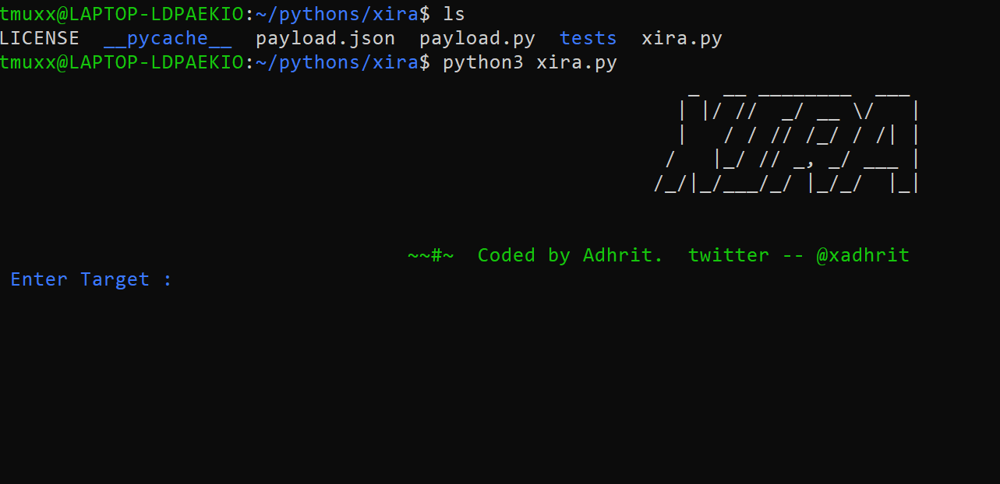
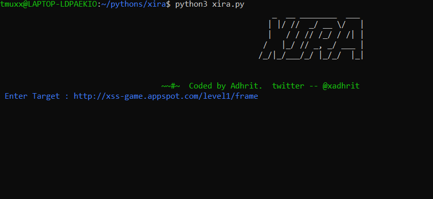
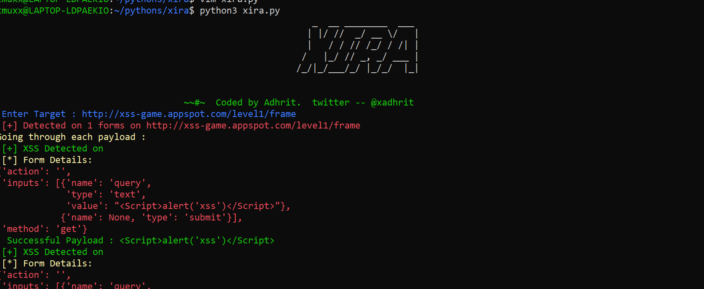

## XIRA : xss vulnerablity scanner 

<p align=center>

</p>


### Installation

```console
# clone the repo
$ git clone https://github.com/xadhrit/xira.git

# change the working directory to xira
$ cd xira

# install the requirements
 
For Linux
$ python3 -m pip install -r requirements.txt

For windows
> python -m pip install -r requirements.txt
```

### Usage

```console
FOR LINUX/WINDOWS

$ python3/python xira.py

Enter the target's url : https://www.example.com
```

<p align=center>

</p>


### Results

```console

$ All details with successfull payloads.
$ True
```

<p align=center>

</p>


##### Todos :

```console

>> Adding sleep functionality that will prevent us to getting blocked

>> Add more and smart payloads

```
###### Issues:
Contact me : <a href= "https://twitter.com/xadhrit">Twitter</a>
            <a href="https://instagram.com/xadhrit">Instagram</a> 
            <p>Email :<strong>adhirt77@gmail.com</strong></p> 
             


