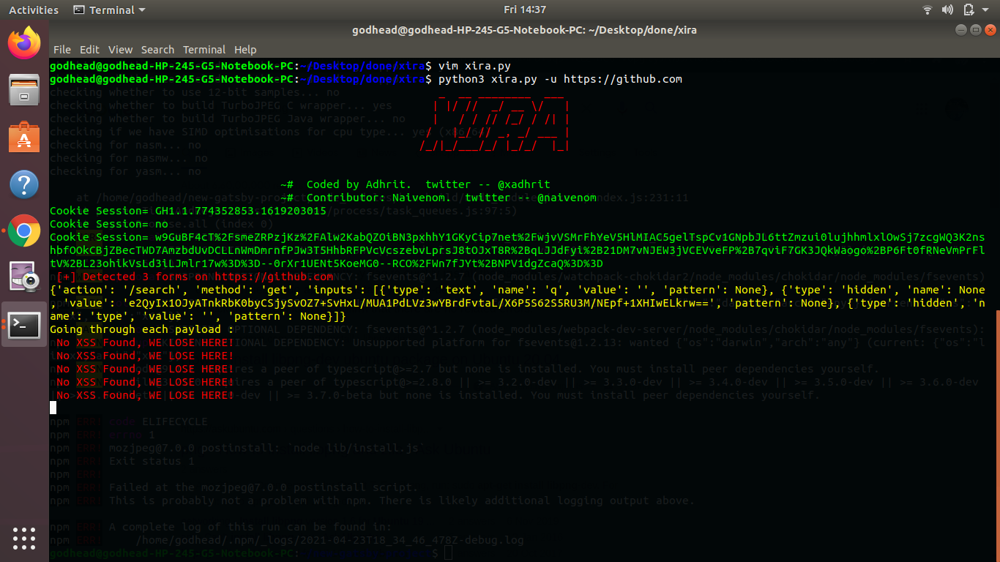

## XIRA : xss vulnerablity scanner 


### Installation

```console
# clone the repo
$ git clone https://github.com/xadhrit/xira.git

# change the working directory to xira
$ cd xira

# install the requirements
 
For Linux
$ python3 -m pip install -r requirements.txt

For windows
> python -m pip install -r requirements.txt
```

### Usage

```console
FOR LINUX/WINDOWS

$ python3/python xira.py -u <url>

Enter the target's url : https://www.example.com
```


### Results

```console

$ All details with successful payloads.
$ True
```

<p align=center>

</p>


### Payloads Template
We can use template.json to use payloads from Seclists or wherever you want. template.json will be our new payload.json file for using in our XSS Scanning. Change the name and make a copy before of payload.json from this repo, and template.json.
```json
{
  "payload": [
    {
      "payload_name": " <h2>Basic injects</h2> "
    }
  ]
}
```
```bash
#!/bin/bash
filename='XSS-Jhaddix.txt'
n=1
while read line; do
# reading each line
jq --arg value "$line" '.payload|=.+[{ "payload_name" : $value }]' payload_template.json >tmp.json
mv tmp.json payload_template.json
echo "Line No. $n : $line"
n=$((n+1))
done < $filename
```

##### Payloads :

```console

clone the repo : git clone https://github.com/xadhrit/xss-hacker.git

```
###### Issues:
Contact me : <a href= "https://twitter.com/xadhrit">Twitter</a>
<br />
*Open an issue on github.com/xadhrit/xira/issues/*

**LICENSE**

*Distributed Under MIT License*
           

